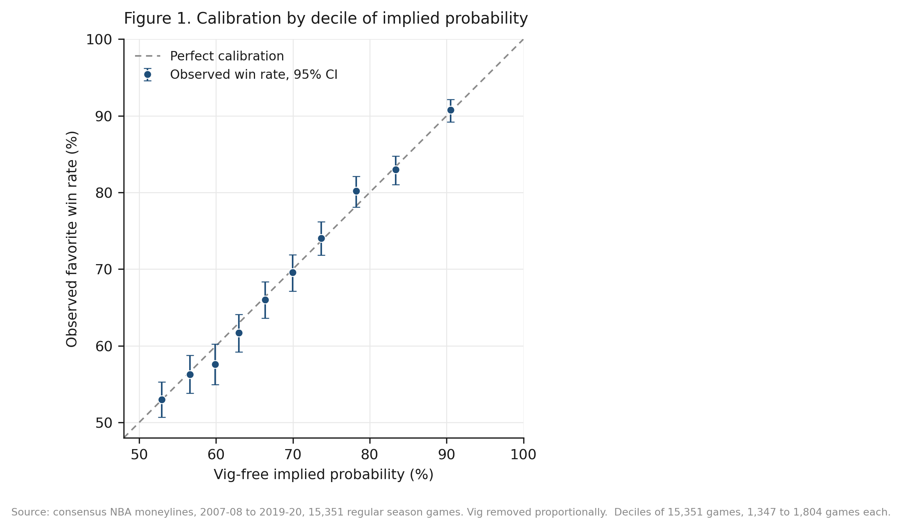
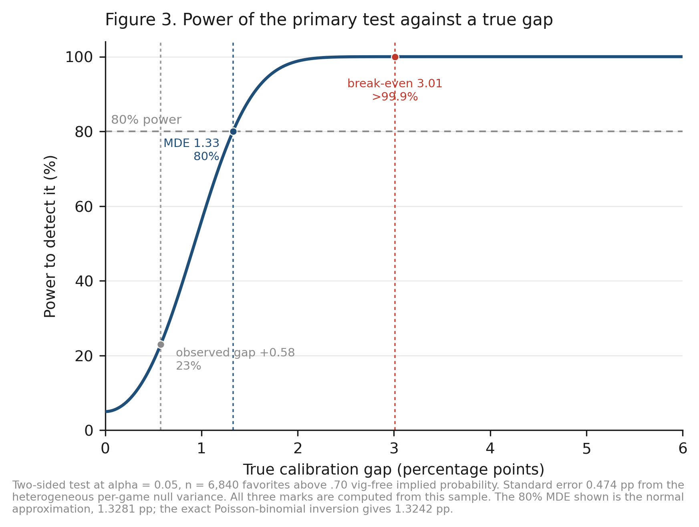
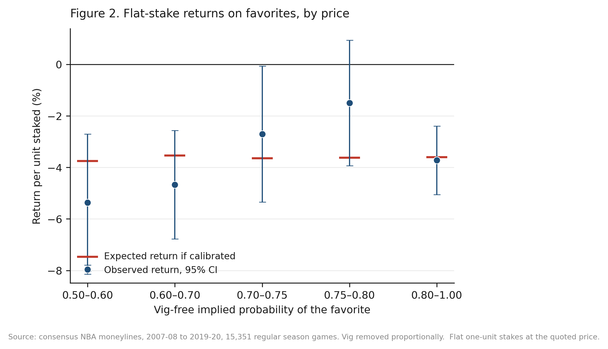

# Are NBA Consensus Moneylines Calibrated?

**A pre-specified test for favorite bias in 15,351 games**

Jacob Burdier · The Scholars' Academy · 2026

Replication materials for a pre-specified, power-justified calibration test
of NBA consensus moneylines, 2007-08 through 2019-20.

---

## Finding

Favorites priced above .70 vig-free implied probability won **80.83 percent**
of the time against an implied **80.26 percent**. The gap is **+0.58
percentage points** (z = 1.22, p = .223). A logistic calibration regression
cannot reject perfect calibration (slope 1.049, joint Wald p = .293). No
pre-specified odds bucket deviates after Holm correction and no single
season deviates.

The economic reading is the sharper one. At quoted prices a favorite bettor
needed favorites to beat their vig-free probability by **3.01 percentage
points** to break even. The entire confidence interval for the observed gap
sits below half of that.

**In this sample, the aggregate favorite calibration gap was too small to
exploit** in every season and odds range examined, and the estimate holds
under six variance estimators that allow correlation within seasons and
within teams. One qualification: of five vig-removal rules, four leave the
gap below its own break-even threshold and one does not. See the
robustness section below, which reports it rather than burying it.

A methodological caution is quantified along the way: testing raw implied
probabilities without removing the vig manufactures an apparent favorite
bias of **2.5 percentage points** (z = -5.90) that is the bookmaker margin,
not bettor behavior.



*Figure 1. Observed favorite win rates against vig-free implied probability, by decile, with 95% Wilson intervals, against the line of perfect calibration.*

## Why the design matters more than the answer

Underpowered bucket tests are the recurring problem in this literature. A
74-game bucket of extreme favorites, the kind these studies routinely
report, has about **11 percent power** to detect a deviation the size of
this sample's own break-even margin, 3.01 percentage points. Both a significant result and a null result from a test like
that are uninformative.

This design fixes the analysis plan first, sets the smallest effect worth
detecting at the margin a bettor must actually overcome, and reaches a
minimum detectable effect of **1.33 percentage points** against a **3.01
point** break-even bar. Whatever the outcome, the result is informative.

## Reproduce it

```bash
git clone https://github.com/jacobburdier05/nba-moneyline-calibration.git
cd nba-moneyline-calibration
pip install -r requirements.txt
bash run_all.sh
```

Runtime is about six minutes on a laptop. `run_all.sh` runs verification,
builds the dataset, runs the confirmatory analyses, runs the robustness
checks, regenerates all three figures, and verifies the Appendix A proof. Every number in the paper is printed
to the console and written to `results/`.

## The paper

The manuscript is in [`paper/`](paper/), in Word and PDF, with a separate
supplement carrying the technical material: the Shin derivation and its
numerical verification, the exact Poisson-binomial power computation, the
season-by-season table, the record of a withdrawn literature claim, and the
step-by-step reproduction guide. Every statistic and figure in both is
regenerated by `run_all.sh` from the raw archive.

## What is in here

```
data/
  raw/                       source files, unmodified
  processed/games.csv        analysis dataset, one row per game
preregistration/
  analysis_plan.md           the frozen plan, transcribed
src/
  odds.py                    odds conversion and de-vigging
  verify_data.py             data verification, run first
  build_dataset.py           exclusions and probability construction
  primary_analysis.py        the confirmatory test and secondaries
  robustness.py              seasons, tail, bootstrap
  figures.py                 Figures 1 and 2
  normalization_robustness.py  five vig-removal rules compared
  dependence_robustness.py   cluster-robust and block-bootstrap variance
  power_curve.py             Figure 3 and the full power table
  shin_equivalence_proof.py  Appendix A, proof verified against the sample
  return_simulation.py       simulated null for the flat-stake return intervals
  equivalence_and_fixed_sample.py  equivalence test, fixed-sample vig rules
  fetch_source_data.py       re-download upstream files and verify subsets
results/                     machine-readable output, JSON and CSV
figures/                     Figures 1, 2 and 3, PNG and PDF at 300 dpi
paper/
  NBA_Moneyline_Calibration_Paper.docx     manuscript
  NBA_Moneyline_Calibration_Paper.pdf      manuscript, 15 pages
  NBA_Moneyline_Calibration_Supplement.docx  supplementary material
  NBA_Moneyline_Calibration_Supplement.pdf   supplementary material, 6 pages
docs/
  pre_specification.md       what the pre-specification claim rests on
  errata.md                  corrections between paper and code
```

## Verification

`src/verify_data.py` runs before anything else and must pass.

| Check | Result |
|---|---|
| Moneylines cross-validated against an independent extraction | **30,978 of 30,978 match** |
| Outcomes cross-validated | **15,490 of 15,490 match** |
| Season game counts vs the true NBA schedule | **13 of 13 seasons exact** |
| Invalid outcome codes | 0 |
| Missing moneylines in source | 1, excluded |

The schedule check includes the three irregular seasons: the 990-game
2011-12 lockout year, the 1,229-game 2012-13 season after one cancellation,
and the 971 games played in 2019-20 before the March 2020 suspension.

A separate manual audit of 260 games against the live sportsbookreviewsonline
primary source is described in `docs/pre_specification.md`.

## Data provenance

Consensus moneylines and final scores originate from the
[sportsbookreviewsonline.com archive](https://www.sportsbookreviewsonline.com/scoresoddsarchives/nba/nbaoddsarchives.htm)
and reach this repository through the public data repository accompanying
Dotan (2020), [`guydotan/ucla-thesis`](https://github.com/guydotan/ucla-thesis).

The archive reports one moneyline per side per game. It does **not**
document whether the line is an opening or closing quote, and it does not
identify the originating sportsbook. This paper therefore calls them
*consensus moneylines*. Convention treats archive lines of this kind as
closing quotes; that claim is not verifiable from the source and is not
made here.

The source pipeline had already dropped playoff games, so the sample is
regular season only.

## Sample construction

| Step | Games |
|---|---|
| Source rows | 15,490 |
| Less missing moneyline | -1 |
| Less pick'em, neither side a favorite | -138 |
| **Analysis sample** | **15,351** |

Mean overround on the analysis sample is 3.77 percent. Favorite vig-free
implied probabilities span .502 to .985.

## Headline results

**Primary test**, favorites above .70 vig-free implied probability:

| | |
|---|---|
| n | 6,840 (44.6% of sample) |
| Observed wins | 5,529 |
| Expected wins | 5,489.45 |
| Observed rate | 80.83% |
| Implied rate | 80.26% |
| Gap | +0.58 pp |
| z | 1.22 |
| p | .223 |
| Season-blocked bootstrap 95% CI | -0.19 to +1.26 pp |
| Minimum detectable effect | 1.33 pp |
| Break-even requirement | 3.01 pp |

**Buckets**, Holm corrected:

| Bucket | n | Observed | Implied | Gap (pp) | z | p | Holm p |
|---|---|---|---|---|---|---|---|
| (.50, .60] | 4,064 | 54.45% | 55.44% | -0.99 | -1.27 | .204 | .817 |
| (.60, .70] | 4,447 | 64.11% | 64.85% | -0.74 | -1.04 | .300 | .899 |
| (.70, .75] | 1,933 | 73.10% | 72.39% | +0.71 | 0.70 | .485 | .970 |
| (.75, .80] | 1,661 | 79.11% | 77.38% | +1.73 | 1.69 | .091 | .457 |
| (.80, 1.00] | 3,246 | 86.32% | 86.41% | -0.09 | -0.15 | .880 | .970 |

**Vig-removal robustness.** The primary test re-run under five normalizations.
Four of five leave the gap below that rule's own break-even requirement; power
normalization does not. The existence, size and sign of estimated favorite bias
in this market all move with the normalization choice, which is the paper's
more durable finding.

| Rule | n | Gap (pp) | p | Break-even (pp) | Verdict |
|---|---|---|---|---|---|
| None, raw probabilities | 8,014 | -2.50 | <.001 | — | artifact |
| Proportional (primary) | 6,840 | +0.58 | .223 | 3.01 | below |
| Additive, equal margin | 7,120 | -0.60 | .186 | 1.88 | below |
| Shin (1993) | 7,120 | -0.60 | .186 | 1.88 | below |
| Constant odds ratio | 7,202 | -0.74 | .104 | 1.79 | below |
| Power | 7,211 | -1.31 | .004 | 1.24 | **exceeds** |

For a two-outcome book Shin's rule coincides exactly with the additive rule.
Proved in `src/shin_equivalence_proof.py`, which derives the result and checks
every step against the sample to machine precision (max error 3.3e-16). The
recovered insider share z runs 0.4% to 7.2%, so these are genuine Shin
solutions, not a degenerate case.

**Dependence robustness.** The gap is +0.58 pp under every variance estimator;
only the standard error moves, from 0.39 to 0.53 pp against the
Poisson-binomial 0.47. None of the six rejects calibration. The secondary
calibration regression is less stable: joint Wald p is .293 classical, .085
clustered on season, .037 two-way on season and team, the last on only 13
clusters where cluster-robust variance is unreliable.

**Power.** 80% at the 1.33 pp minimum detectable effect, >99.9% at the 3.01 pp
break-even requirement. The MDE is the conventional normal approximation; the
exact Poisson-binomial inversion gives 1.3242 pp, a difference of 0.004 pp,
and the exact two-sided rejection region is 5,425 wins or fewer or 5,554 or
more with true size .0484.

Every mark on Figure 3 is computed from this sample. An earlier draft marked
1.7 and 5.1 pp as the smallest and largest favorite-bias effects in the cited
literature. Neither could be traced to any source in that citation set: six of
the eight cited papers report rates of return or point-spread cover rates
rather than win-probability calibration gaps, and the one literature review
among them reports no magnitudes at all. They were removed rather than
re-sourced. See `docs/errata.md` item 11.



*Figure 3. Power against a true calibration gap. Every mark is computed from this sample: the observed +0.58 pp gap, the 1.33 pp minimum detectable effect, and the 3.01 pp break-even requirement.*

**Seasons:** season gaps range -2.82 to +2.52 pp, none rejecting
(smallest p = .107). Cochran Q = 8.37 on 12 df, p = .756, I-squared 0
percent. The tail above .90 (756 games) shows +0.63 pp, p = .506.

**Returns**, flat one-unit stakes at quoted prices:

| Group | Return | 95% CI |
|---|---|---|
| All favorites | -4.06% | -5.13 to -3.00 |
| All underdogs | -3.91% | -6.57 to -1.25 |
| Favorites above .70 | -2.90% | -4.04 to -1.75 |

Losses track the mean overround. Money is lost in every direction, which is
what a calibrated market with a margin looks like.



*Figure 2. Flat one-dollar stakes on the favorite at the quoted price, by bucket, with 95% intervals. The expected-return marker is computed from the actual quoted odds in each bucket.*

## Scope of the null

The result does **not** rule out:

- localized situational biases outside the pre-specified slices
- mispricing at individual books
- inefficiency in opening lines
- edges available through best-price shopping across books

The sample is regular season only and ends in March 2020, where the source
archive ends. It therefore predates the subsequent expansion of US legal
sports betting; no claim is made here about whether that expansion changed
market behavior.

## Requirements

Python 3.9 or later. `numpy`, `pandas`, `scipy`, `statsmodels`,
`matplotlib`. See `requirements.txt`.

## Citation

```bibtex
@misc{burdier2026moneyline,
  author = {Burdier, Jacob},
  title  = {Are {NBA} Consensus Moneylines Calibrated? A Pre-Specified
            Test for Favorite Bias in 15,351 Games},
  year   = {2026},
  note   = {Replication materials},
  url    = {https://github.com/jacobburdier05/nba-moneyline-calibration}
}
```

## License

Code is MIT licensed. See `LICENSE`. Source data belongs to its original
publishers and is redistributed here under the terms of the upstream
repository for replication purposes only.

## AI disclosure

AI tools assisted with code generation, statistical checking, data
verification, and editing. The study design, assumptions, results, and
final claims are the author's responsibility. No AI-generated source or
statistic is cited as evidence.
