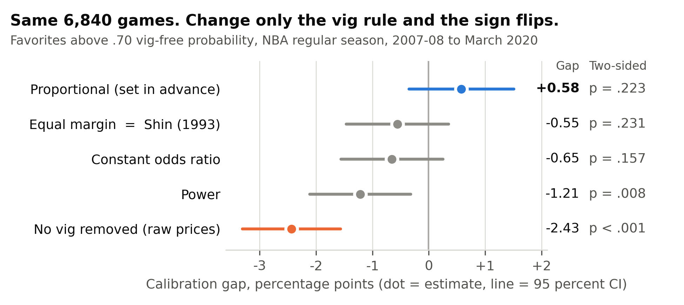
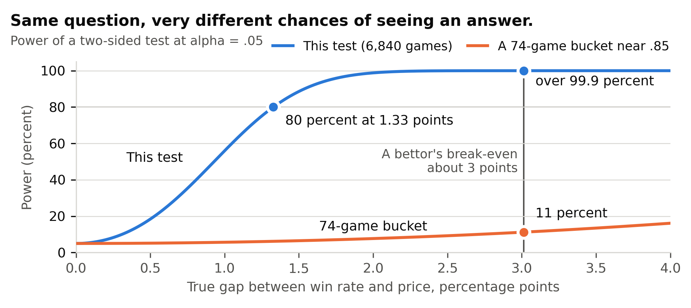

# Vig Removal Changes the Answer

**A pre-specified calibration test of 15,351 archived NBA moneylines**

Jacob Burdier · The Scholars' Academy, Queens, NY · ORCID [0009-0004-9468-6513](https://orcid.org/0009-0004-9468-6513)

| Read it | |
|---|---|
| Paper, 15 pages | [PDF](paper/NBA_Moneyline_Calibration_Paper.pdf) · [Word](paper/NBA_Moneyline_Calibration_Paper.docx) |
| Supplement, 9 pages | [PDF](paper/NBA_Moneyline_Calibration_Supplement.pdf) · [Word](paper/NBA_Moneyline_Calibration_Supplement.docx) |
| Slides, 22 | [PDF](paper/NBA_Moneyline_Calibration_Slides.pdf) · [PowerPoint](paper/NBA_Moneyline_Calibration_Slides.pptx) |
| Conference abstract, 2 pages | [PDF](paper/NBA_Moneyline_Calibration_Abstract.pdf) |
| Every correction I've made | [docs/errata.md](docs/errata.md) |

---

## The short version

Almost every test of betting-market bias starts with the same step: taking
the sportsbook's cut out of the price. There isn't one correct way to do
that, and most papers pick a method in one sentence and move on. I wanted
to know how much the answer depends on that sentence.

I tested one question, fixed before I looked at any outcomes: do NBA
favorites with a vig-free win probability above .70 win as often as their
prices say?

Under the rule I picked in advance, the answer is close enough. Favorites
above .70 (6,840 games) won **80.83 percent** of the time against an
implied **80.26 percent**. That's a gap of **+0.58 percentage points**
(z = 1.22, p = .223, 95 percent CI -0.35 to +1.51). A bettor needed 2.99
points to break even, and an equivalence test rules out a gap that big
(p = 4.7e-08).

Then I changed only the vig-removal rule, on the same games. The gap
moves from **-1.21 to +0.58**. That's not a rounding issue, it's a sign
flip. Power normalization makes the gap significant (p = .008), and
skipping vig removal entirely shows a favorite bias of -2.43 points that's
really just the sportsbook's cut.

So the real finding isn't the null. It's that the evidence for favorite
bias depends on a step most papers never report.



## Reproduce it

```bash
git clone https://github.com/jacobburdier05/nba-moneyline-calibration.git
cd nba-moneyline-calibration
pip install -r requirements.txt
bash run_all.sh
```

It takes about six minutes on a laptop. Step 1 checks the data and stops
everything if a check fails. Every number in the paper prints to the
console and gets written to `results/`. Every figure gets rebuilt in
`figures/`.

## What's in here

```
paper/
  NBA_Moneyline_Calibration_Paper.pdf / .docx        the paper, 15 pages
  NBA_Moneyline_Calibration_Supplement.pdf / .docx   the supplement, 9 pages
  NBA_Moneyline_Calibration_Slides.pdf / .pptx       the slides, 22
  NBA_Moneyline_Calibration_Abstract.pdf             the conference abstract
data/
  raw/                       source files, unmodified
  processed/games.csv        analysis dataset, one row per game
preregistration/
  analysis_plan.md           the frozen plan, transcribed
src/
  odds.py                    odds conversion and vig removal
  verify_data.py             data checks, run first
  build_dataset.py           exclusions and probabilities
  primary_analysis.py        the main test and the secondary tests
  robustness.py              seasons, tail, bootstrap
  figures.py                 paper Figures 1 and 2
  normalization_robustness.py  five vig-removal rules compared
  dependence_robustness.py   clustered errors and block bootstraps
  power_curve.py             paper Figure 3 and the power table
  shin_equivalence_proof.py  supplement S1, checked against every game
  return_simulation.py       simulated null for the return intervals
  equivalence_and_fixed_sample.py  equivalence test, same-sample vig rules
  abstract_figures.py        the two abstract figures
  fetch_source_data.py       re-downloads the source files and checks them
results/                     every number, as JSON and CSV
figures/                     every figure, PNG and PDF at 300 dpi
docs/
  pre_specification.md       what the pre-specification claim rests on
  errata.md                  every correction, in order
run_all.sh                   runs all eleven steps
```

## The data

Consensus moneylines and final scores come from the
[Sportsbook Reviews Online archive](https://www.sportsbookreviewsonline.com/scoresoddsarchives/nba/nbaoddsarchives.htm)
and reach this repo through the public data repository for Dotan (2020),
[`guydotan/ucla-thesis`](https://github.com/guydotan/ucla-thesis).

The archive gives one moneyline per side per game. It doesn't say whether
that's an opening or closing line, and it doesn't name the sportsbook. So
I call them consensus moneylines and don't claim they're closing lines.
The source had already dropped playoff games, so this is regular season
only. It ends in March 2020 because that's where the archive ends.

| Step | Games |
|---|---|
| Source rows | 15,490 |
| Missing moneyline | -1 |
| Pick'em, no favorite | -138 |
| **Analysis sample** | **15,351** |

Mean overround is 3.77 percent. Favorite vig-free probabilities run from
.502 to .985.

### Checks that run before anything else

| Check | Result |
|---|---|
| Moneylines against a separate extraction of the same archive | **30,978 of 30,978 match** |
| Outcomes against that extraction | **15,490 of 15,490 match** |
| Games per season against the real NBA schedule | **13 of 13 seasons exact** |
| Invalid outcome codes | 0 |
| Missing moneylines | 1, excluded |

The schedule check includes the 990-game 2011-12 lockout season, the
1,229-game 2012-13 season after one cancellation, and the 971 games played
in 2019-20 before the shutdown. A hand audit of 260 games against the live
archive is described in `docs/pre_specification.md`.

## Results

### The main test

Favorites above .70 vig-free probability, proportional vig removal, all
fixed in advance.

| | |
|---|---|
| Games | 6,840 (44.6 percent of the sample) |
| Wins, observed | 5,529 |
| Wins, expected | 5,489.45 |
| Win rate, observed | 80.83 percent |
| Win rate, implied | 80.26 percent |
| Gap | +0.58 points |
| z, p | 1.22, .223 |
| 95 percent CI | -0.35 to +1.51 points |
| Break-even for a bettor | 2.99 points (exact), 3.01 (simple average) |
| Equivalence test, TOST p | 4.7e-08 |

### Same games, every vig-removal rule

All 6,840 games stay fixed. Only the rule changes.

| Rule | Gap (points) | p | That rule's break-even |
|---|---|---|---|
| None, raw prices | -2.43 | <.001 | none |
| Proportional (set in advance) | +0.58 | .223 | 3.01 |
| Equal margin | -0.55 | .231 | 1.88 |
| Shin (1993) | -0.55 | .231 | 1.88 |
| Constant odds ratio | -0.65 | .157 | 1.78 |
| Power | -1.21 | .008 | 1.22 |

The sign flips and one rule turns significant. No rule produces a gap a
bettor could have used: power comes closest, at -1.21 against its own
1.22 break-even.

If each rule is allowed to pick its own games above .70, the spread is a
little wider (-1.31 to +0.58, Table 5 in the paper). That version mixes
two changes at once, which is why the same-sample table above is the one
to read. `docs/errata.md` item 16a explains.

Shin (1993) and equal margin give identical numbers because, for a
two-outcome bet, they're the same rule. Clarke, Kovalchik and Ingram
(2017) proved this. `src/shin_equivalence_proof.py` checks it against
every game to machine precision (largest error 3.3e-16).

### Dependence

The gap is +0.58 under every variance estimator. Only the standard error
moves, from 0.39 to 0.53 points against the Poisson-binomial 0.47, and
none of the six rejects. The season-blocked bootstrap gives -0.19 to
+1.26 points. The secondary calibration regression is shakier: its joint
p is .293 with plain errors, .085 clustered by season, and .037 two-way,
the last on only 13 seasons. I read that slope as unresolved, not
confirmed.

### Power

80 percent power at 1.33 points. Over 99.9 percent at the break-even. A
74-game bucket near .85, the kind past studies often report, has about 11
percent at the same break-even.



### Buckets, Holm corrected

| Bucket | Games | Observed | Implied | Gap | z | p | Holm p |
|---|---|---|---|---|---|---|---|
| (.50, .60] | 4,064 | 54.45 | 55.44 | -0.99 | -1.27 | .204 | .817 |
| (.60, .70] | 4,447 | 64.11 | 64.85 | -0.74 | -1.04 | .300 | .899 |
| (.70, .75] | 1,933 | 73.10 | 72.39 | +0.71 | 0.70 | .485 | .970 |
| (.75, .80] | 1,661 | 79.11 | 77.38 | +1.73 | 1.69 | .091 | .457 |
| (.80, 1.00] | 3,246 | 86.32 | 86.41 | -0.09 | -0.15 | .880 | .970 |

Seasons run from -2.82 to +2.52 points and none rejects (smallest
p = .107). Cochran Q = 8.37 on 12 df, p = .756.

### Returns

Flat one-unit bets at the quoted prices.

| Group | Return | 95 percent CI |
|---|---|---|
| All favorites | -4.06 percent | -5.13 to -3.00 |
| All underdogs | -3.91 percent | -6.57 to -1.25 |
| Favorites above .70 | -2.90 percent | -4.04 to -1.75 |

You lose money every way you cut it, which is what a calibrated market
with a margin looks like.

## What this doesn't rule out

- biases in situations outside the slices I set in advance
- mispricing at a single sportsbook
- edges in opening lines
- edges from shopping for the best price across books

It also says nothing about betting after March 2020, when legal sports
betting expanded across the US.

## Cite it

```bibtex
@misc{burdier2026vig,
  author = {Burdier, Jacob},
  title  = {Vig Removal Changes the Answer: A Pre-Specified Calibration
            Test of 15,351 Archived {NBA} Moneylines},
  year   = {2026},
  note   = {Replication materials. ORCID 0009-0004-9468-6513},
  url    = {https://github.com/jacobburdier05/nba-moneyline-calibration}
}
```

## Requirements

Python 3.9 or later with `numpy`, `pandas`, `scipy`, `statsmodels` and
`matplotlib`. See `requirements.txt`.

## License

Code is MIT licensed, see `LICENSE`. The source data belongs to its
original publishers and is shared here under the upstream repository's
terms, for replication only.
